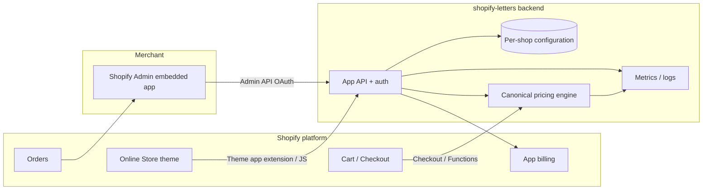

# Technical Architecture Outline — shopify-letters

**Purpose:** Translate the PRD capability contract (FR1–FR26, NFRs) into a coherent system shape for implementation. This is an outline, not a full architecture decision record (ADR) set.

**Related:** `../_bmad-output/planning-artifacts/prd.md`

---

## 1. Architectural goals

| Goal | PRD trace |
|------|-----------|
| **Single canonical price** for a given product + customization inputs | FR19, FR22; NFR reliability |
| **Same logic** for storefront preview and checkout enforcement | Executive summary, Domain risks |
| **Strict shop isolation** | FR5; SaaS B2B tenancy |
| **Auditable orders** (text + rule context) | FR23–FR25 |
| **Observable mismatch / failures** | FR26; NFR reliability |
| **No v1 non-Shopify integrations** | Domain + SaaS scope |

---

## 2. System context (C4: system landscape)

**Actors**

- **Merchant:** configures products, fields, and rules in the embedded app (FR6–FR13, FR1–FR4).
- **Shopper:** interacts with storefront UI (theme extension) and cart/checkout (FR14–FR22).
- **Platform:** Shopify hosts storefront, cart, checkout, orders, and billing; the app extends these surfaces.

---

## 3. Major components

### 3.1 Embedded admin application

- **Responsibility:** CRUD for per-shop configuration: enabled products, fields, character rules, group pricing, publish state (FR6–FR13).
- **Integration:** Shopify App Bridge, Admin GraphQL (products, metafields or app-owned storage as chosen), billing APIs for trial/subscription (FR1–FR4).
- **Tenancy:** Every request resolves `shop` from session token; all reads/writes scoped to that shop (FR5).

### 3.2 Configuration store (per shop)

- **Content:** Structured definitions: products linked to customization definitions; fields; validation rules; base/per-character and group pricing; versioning or updated-at for cache invalidation.
- **Placement options (implementation choice):** app-owned database keyed by shop + Shopify product IDs; and/or Shopify metafields for read-optimized storefront access. Outline recommendation: **database as source of truth** for complex rules + denormalized snippets for storefront if needed for latency.

### 3.3 Storefront module (customer-facing)

- **Responsibility:** Render customization UI on product pages for enabled products (FR14–FR17); call **preview pricing** on input changes; validate against the same rules the server will enforce (FR15, FR16).
- **Form:** Theme app extension (app block) or equivalent Online Store 2.0 integration; progressive enhancement and WCAG-oriented markup (NFR accessibility).
- **Preview path:** Client calls app backend **preview endpoint** with `{ shop, product, field inputs }` → returns `{ valid, errors, price, breakdown }` using the **canonical pricing engine** (same module as enforcement).

### 3.4 Cart line payload

- **Responsibility:** When adding to cart, attach structured customization data (and a **pricing snapshot id** or signed payload) so cart and checkout can revalidate (FR18, FR21).
- **Mechanism:** Line item properties, cart attributes, or cart transform–compatible representation—exact Shopify mechanism is an implementation detail, but the **data contract** must include everything needed to recompute price and display labels (FR21).

### 3.5 Checkout price enforcement

- **Responsibility:** Authoritative application of price for customized lines (FR19, FR20, FR22). Browser cannot be the source of truth.
- **Pattern:** Use **Shopify checkout extensibility** (for example **Shopify Functions** operating on cart lines) that invokes the same pricing rules as preview, or a platform-supported flow that recomputes and adjusts the line before payment. Exact function type (cart transform, discount, product variant strategy) is a **decision during implementation** against current Shopify APIs and constraints.
- **Invariant:** Input normalization + pricing algorithm shared with preview (single module).

### 3.6 Canonical pricing engine (core library)

- **Responsibility:** Pure, deterministic function: `(rules, normalized_inputs) → { price_minor, breakdown, validation_errors }`.
- **Deployment:** Packaged for use in app server (preview API) and in checkout function runtime (WASM/subset per Shopify constraints), or called via a tightly controlled RPC if platform limits require—**minimize divergence** between paths.
- **Normalization:** Single module for character groups, allowed/disallowed sets, and counting—prevents preview/checkout drift (Domain technical constraints).

### 3.7 Orders and fulfillment projection

- **Responsibility:** Ensure order lines show customization text and pricing-relevant metadata for merchants (FR23–FR25). Typically line item properties + order notes or metafields as supported.
- **Support:** Enough structured data for “price looked wrong” diagnosis (FR25).

### 3.8 Observability

- **Metrics:** Preview latency, add-to-cart failures, checkout adjustment failures, mismatch detector (preview vs charged), rate of validation errors (FR26, NFR performance/reliability).
- **Logs:** Correlation id across preview → cart → checkout for a session where possible.

---

## 4. Primary data flows

### 4.1 Configuration (merchant)

1. Merchant opens embedded app → OAuth session establishes shop context.
2. Save/update rules in configuration store → optional publish flag invalidates storefront caches (FR12).

### 4.2 Shopping (customer)

1. Product page loads → storefront module fetches “is this product customized?” + field schema (public-safe subset).
2. User types → debounced **preview** calls pricing engine via API.
3. Add to cart → line carries customization payload + reference for enforcement.
4. Checkout → **enforcement** runs; reject or adjust if invalid (FR20); charge matches enforced price (FR22).

### 4.3 Post-purchase

1. Order webhook or polling → verify line items contain customization payload for merchant UI (FR23, FR24).

---

## 5. Security and tenancy

- **Session tokens:** Validate Shopify session on every admin and authenticated API request; derive `shop_id` and reject cross-shop access (FR5).
- **Storefront API:** Public endpoints must not leak other shops’ data; rate-limit and scope to product + shop identifier.
- **Secrets:** API keys, function secrets, and billing credentials in managed secret storage; least privilege (NFR security).

---

## 6. Billing (v1)

- Shopify Billing API for **trial + monthly subscription** (FR2–FR4). Billing service lives in admin/backend; no separate payment PCI scope beyond platform.

---

## 7. Deployment sketch

- **App backend:** Stateless API + worker (webhooks) on a managed host (Fly, Render, AWS, etc.).
- **Database:** Postgres or equivalent for per-shop config and audit-friendly records if needed later.
- **Checkout function:** Deployed via Shopify CLI pipeline; versioned alongside pricing engine package.
- **Storefront assets:** Theme extension bundle versioned with app releases.

---

## 8. Open decisions (resolve during implementation)

1. **Exact checkout mechanism** for authoritative price changes (function type, cart line eligibility, interaction with discounts and taxes).
2. **Where configuration lives** primary: app DB vs metafields vs hybrid for performance.
3. **Signed payload vs server-side re-fetch** of cart lines at checkout to prevent tampering.
4. **Tax display:** how customized line price interacts with tax-inclusive/exclusive storefronts (region-specific).
5. **Multi-currency / markets:** MVP may assume shop default currency; document limitation if so.

---

## 9. Traceability to PRD

| Area | FR coverage |
|------|-------------|
| Admin + billing | FR1–FR5 |
| Rules + fields | FR6–FR13 |
| Storefront | FR14–FR17 |
| Cart/checkout | FR18–FR22 |
| Orders + support | FR23–FR25 |
| Ops | FR26 |

---

## 10. Suggested next engineering steps

1. Spike: **Shopify Function** (or current recommended API) for line-level price adjustment with a **duplicated WASM pricing snippet** vs **remote validation** tradeoff.
2. Define **JSON schema** for per-product customization config and **cart line payload**.
3. Implement **pricing engine** as a pure package with unit tests (normalization edge cases).
4. Build **preview API** + thin storefront extension calling it.
5. Add **minimal metrics** for mismatch and failure rates (FR26).

This outline is ready to split into ADRs as you lock decisions.
